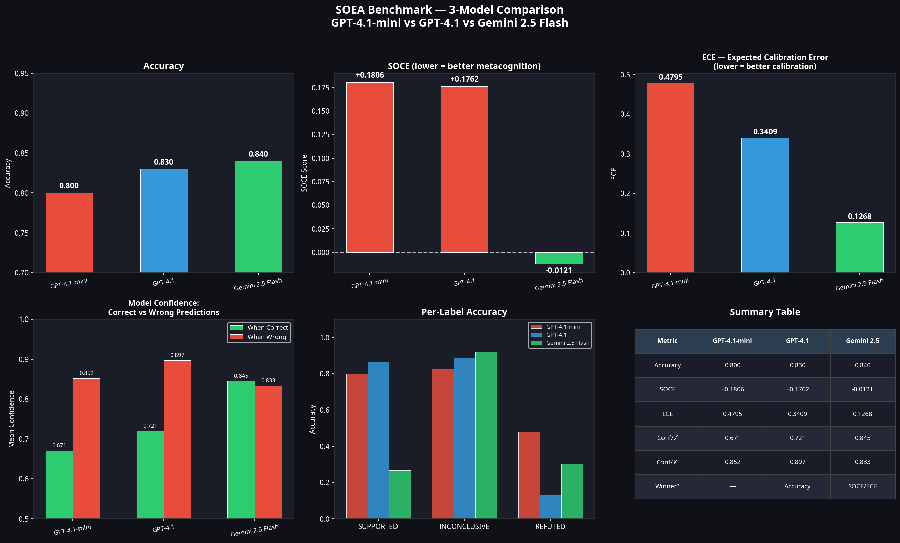

# SOEA-Plus (PDEMC) — Post-Decisional Error Monitoring and Control Benchmark

> **Kaggle Competition:** [Google DeepMind AGI Cognitive Benchmarks](https://www.kaggle.com/competitions/agi-cognitive-benchmarks) | Prize: $20,000 | Deadline: April 16, 2026

[](https://python.org)
[](LICENSE)
[](data/)
[](https://uottawa.ca)

---

## 🚀 Start Here

If you are reviewing this project for the Kaggle competition, please start with these key links:

- 🏆 **[Kaggle Benchmark Submission](https://www.kaggle.com/competitions/kaggle-measuring-agi/writeups)** *(Replace with your actual Kaggle writeup link once submitted)*
- 📄 **[Full Competition Writeup (Markdown)](soea_plus/SOEA_PLUS_COMPETITION_WRITEUP.md)**
- 📊 **[SOEA-Plus Code & Results Directory](soea_plus/)**

---

## ⭐ SOEA-Plus (PDEMC) — The Control Collapse Hypothesis

> **"Models do not fail at knowing — they fail at acting on uncertainty."**  
> — *The Control Collapse Hypothesis*

SOEA-Plus is a full 3-task cognitive benchmark grounded in neuroscience that evaluates whether large language models can not only detect uncertainty but also regulate their behavior accordingly. 

### Control Collapse: Visual Proof


| Model | Task 1 Acc | Monitoring Acc | Control Rationality | PDEMC Score |
|-------|------------|----------------|---------------------|-------------|
| **GPT-4.1** | 83.0% | **83.0%** | 72.0% | **0.7970** |
| **Gemini-2.5-Flash** | **84.0%** | 79.7% | **74.7%** | 0.7957 |
| **GPT-4.1-mini** | 80.0% | 80.0% | 48.3% | 0.7050 |

The results reveal a striking dissociation: GPT-4.1-mini achieves 80% decision accuracy yet only 48.3% control rationality — a **+31.7% Control Collapse Gap** — confirming that metacognitive awareness does not automatically translate into safe behavior.

📄 **[Read the full competition writeup for detailed methodology and analysis →](soea_plus/SOEA_PLUS_COMPETITION_WRITEUP.md)**

---

## 🏛️ Legacy Version: SOEA v1 (Original)

*Note: The following section describes the original 2-task SOEA benchmark. The primary submission for the competition is the upgraded SOEA-Plus (PDEMC) described above.*

**SOEA (Second-Order Error Awareness)** is a task-specific benchmark for evaluating second-order error awareness in large language models (LLMs) — measuring whether models *know when they are wrong*, a critical metacognitive capability for safe AI deployment in biomedical domains.

Unlike traditional benchmarks that measure first-order accuracy, SOEA focuses on **metacognitive calibration**: how well a model's confidence aligns with its actual correctness.

### The SOCE Metric

```
SOCE = Mean confidence when WRONG − Mean confidence when CORRECT
```

This metric directly captures **directional miscalibration**: whether a model becomes more confident when it is incorrect — a key indicator of metacognitive failure.

Unlike ECE, which measures aggregate calibration error, **SOCE isolates second-order error awareness** — specifically measuring overconfidence at the point of failure.

| SOCE Value | Interpretation |
|-----------|----------------|
| SOCE > +0.05 | Model is overconfident when wrong — **poor metacognition** |
| −0.05 < SOCE < +0.05 | Near-random metacognitive calibration |
| SOCE < −0.05 | Model appropriately uncertain when wrong — **good metacognition** |

### Legacy Results

| Model | Accuracy | SOCE | ECE | UA Score |
|-------|----------|------|-----|----------|
| GPT-4.1-mini | 0.8000 | +0.1806 ⚠️ | 0.4795 | −0.6625 |
| GPT-4.1 | 0.8300 | +0.1762 ⚠️ | 0.3409 | — |
| Gemini 2.5 Flash | **0.8400** | **−0.0121** ✅ | **0.1268** | **+0.0337** |

#### 3-Model Comparison Dashboard


### Dataset

- **300 real PubMed claim-evidence pairs** sourced via NCBI E-utilities API
- **Gold-standard human annotation** by domain expert **Haifaa Owayed** (University of Ottawa)
- **Two-pass quality audit** with 91% label-rationale consistency

| Label | Count | Percentage |
|-------|-------|------------|
| SUPPORTED | 15 | 5.0% |
| INCONCLUSIVE | 262 | 87.3% |
| REFUTED | 23 | 7.7% |

The high proportion of INCONCLUSIVE cases reflects real-world scientific uncertainty in biomedical literature, where many studies provide limited, indirect, or preliminary evidence.

### Decision Rules

| Label | Criteria |
|-------|----------|
| **SUPPORTED** | RCT/meta-analysis, p < 0.05, n ≥ 100, evidence directly supports claim |
| **INCONCLUSIVE** | Pilot/observational, small n, hedging language, mismatch, no statistics |
| **REFUTED** | p > 0.05, null result, "no significant difference", contradicts claim |

---

## Repository Structure

```
SOEA-Benchmark/
├── soea_plus/                           # 🌟 NEW: SOEA-Plus (PDEMC) Benchmark
│   ├── SOEA_PLUS_COMPETITION_WRITEUP.md # Full competition report
│   ├── scripts/                         # 3-task evaluation scripts
│   ├── results/                         # Results for 3 frontier models
│   └── figures/                         # Visualizations and diagrams
├── data/
│   └── SOEA_300_gold_FINAL.csv          # Gold-standard annotated dataset
├── results/                             # Legacy SOEA v1 results
├── scripts/                             # Legacy SOEA v1 scripts
├── SOEA_FINAL_COMPETITION_REPORT.md     # Legacy SOEA v1 report
└── README.md
```

---

## Quick Start

```bash
# Clone the repository
git clone https://github.com/Haifawaeedd/SOEA-Benchmark.git
cd SOEA-Benchmark

# Install dependencies
pip install openai pandas numpy matplotlib

# Run SOEA-Plus evaluation
cd soea_plus/scripts
python 01_run_soea_plus_gpt.py
```

---

## Citation

```bibtex
@misc{owayed2026soeaplus,
  title       = {SOEA-Plus (PDEMC): A Benchmark for Post-Decisional Error Monitoring and Control in Biomedical LLMs},
  author      = {Owayed, Haifaa},
  year        = {2026},
  institution = {University of Ottawa},
  note        = {Submitted to Kaggle Google DeepMind AGI Cognitive Benchmarks Competition},
  url         = {https://github.com/Haifawaeedd/SOEA-Benchmark}
}
```

---

## Author

**Haifaa Owayed**  
University of Ottawa  
Kaggle: [Google DeepMind AGI Cognitive Benchmarks Competition](https://www.kaggle.com/competitions/agi-cognitive-benchmarks)

---

## License

This project is licensed under the MIT License — see [LICENSE](LICENSE) for details.
