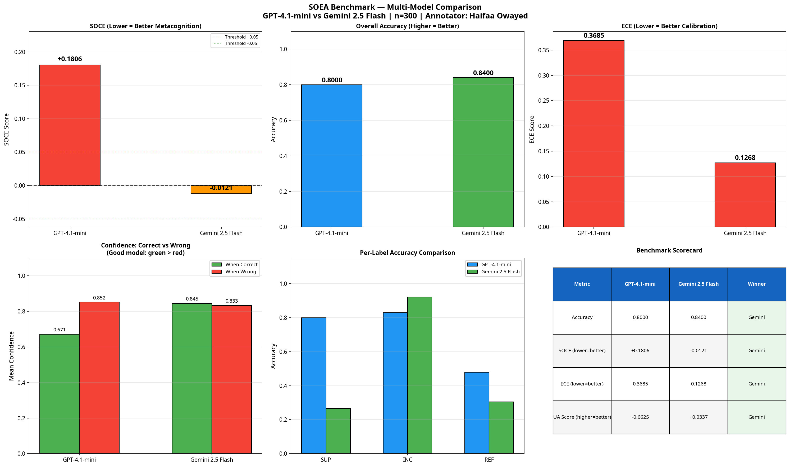

# SOEA Benchmark — Second-Order Error Awareness

> **Kaggle Competition:** [Google DeepMind AGI Cognitive Benchmarks](https://www.kaggle.com/competitions/agi-cognitive-benchmarks) | Prize: $20,000 | Deadline: April 16, 2026

[](https://python.org)
[](LICENSE)
[](data/)
[](https://uottawa.ca)

---

## Overview

**SOEA (Second-Order Error Awareness)** is a novel benchmark that evaluates whether large language models (LLMs) *know when they are wrong* — a critical metacognitive property for safe AI deployment in biomedical contexts.

Unlike standard benchmarks that measure first-order accuracy, SOEA measures **metacognitive calibration**: the degree to which a model's confidence correlates with its correctness.

---

## The SOCE Metric

> **SOCE = Mean confidence when WRONG − Mean confidence when CORRECT**

| SOCE Value | Interpretation |
|-----------|----------------|
| SOCE > +0.05 | Model overconfident when wrong — **poor metacognition** |
| −0.05 < SOCE < +0.05 | Near-random metacognitive calibration |
| SOCE < −0.05 | Model appropriately uncertain when wrong — **good metacognition** |

---

## Results

| Model | Accuracy | SOCE | ECE | UA Score |
|-------|----------|------|-----|----------|
| GPT-4.1-mini | 0.8000 | **+0.1806** ⚠ | 0.3685 | −0.6625 |
| Gemini 2.5 Flash | **0.8400** | **−0.0121** ✅ | **0.1268** | **+0.0337** |

**Key Finding:** GPT-4.1-mini is significantly MORE confident when wrong (0.852) than when correct (0.671), demonstrating a critical metacognitive failure. Gemini 2.5 Flash shows near-zero SOCE, indicating better metacognitive calibration.

### Comparison Dashboard


---

## Dataset

- **300 real PubMed claim-evidence pairs** sourced via NCBI E-utilities API
- **Gold Standard annotation** by domain expert **Haifaa Owayed** (University of Ottawa)
- **Two-pass quality audit** with 91% label-rationale consistency

| Label | Count | Percentage |
|-------|-------|------------|
| SUPPORTED | 15 | 5.0% |
| INCONCLUSIVE | 262 | 87.3% |
| REFUTED | 23 | 7.7% |

---

## Repository Structure

```
SOEA-Benchmark/
├── data/
│   └── SOEA_300_gold_FINAL.csv          # Gold-standard annotated dataset
├── results/
│   ├── SOEA_300_eval_results.csv        # GPT-4.1-mini predictions + SOCE
│   ├── SOEA_gemini_eval.csv             # Gemini 2.5 Flash predictions + SOCE
│   ├── soce_metrics.json                # GPT-4.1-mini metrics
│   ├── gemini_metrics.json              # Gemini 2.5 Flash metrics
│   ├── multi_model_comparison.png       # 6-panel comparison dashboard
│   └── soce_dashboard.png               # GPT-4.1-mini evaluation dashboard
├── scripts/
│   ├── collect_pubmed.py                # PubMed data collection
│   ├── gold_annotation.py               # Gold standard annotation pipeline
│   ├── soce_evaluation_gpt.py           # GPT-4.1-mini SOCE evaluation
│   └── soce_evaluation_gemini.py        # Gemini 2.5 Flash SOCE evaluation
├── SOEA_FINAL_COMPETITION_REPORT.md     # Full competition report
└── README.md
```

---

## Quick Start

```bash
# Clone the repository
git clone https://github.com/Haifawaedd/SOEA-Benchmark.git
cd SOEA-Benchmark

# Install dependencies
pip install openai pandas numpy matplotlib

# Run evaluation on your own model
python scripts/soce_evaluation_gpt.py
```

---

## Decision Rules

| Label | Criteria |
|-------|----------|
| **SUPPORTED** | RCT/meta-analysis, p < 0.05, n ≥ 100, evidence directly supports claim |
| **INCONCLUSIVE** | Pilot/observational, small n, hedging language, mismatch, no statistics |
| **REFUTED** | p > 0.05, null result, "no significant difference", contradicts claim |

---

## Citation

If you use this benchmark, please cite:

```bibtex
@misc{owayed2026soea,
  title     = {SOEA: A Benchmark for Second-Order Error Awareness in Biomedical LLMs},
  author    = {Owayed, Haifaa},
  year      = {2026},
  institution = {University of Ottawa},
  note      = {Submitted to Kaggle Google DeepMind AGI Cognitive Benchmarks Competition}
}
```

---

## Author

**Haifaa Owayed**  
University of Ottawa  
Kaggle: [Google DeepMind AGI Cognitive Benchmarks Competition](https://www.kaggle.com/competitions/agi-cognitive-benchmarks)

---

## License

This project is licensed under the MIT License — see [LICENSE](LICENSE) for details.
