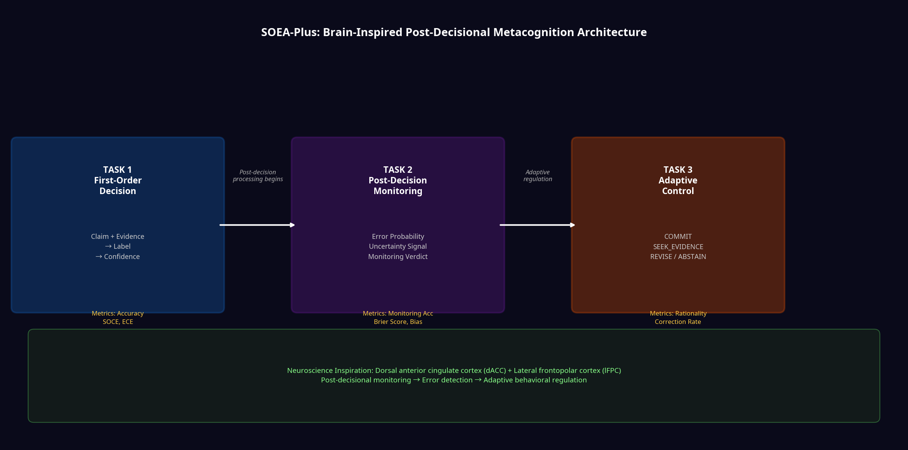
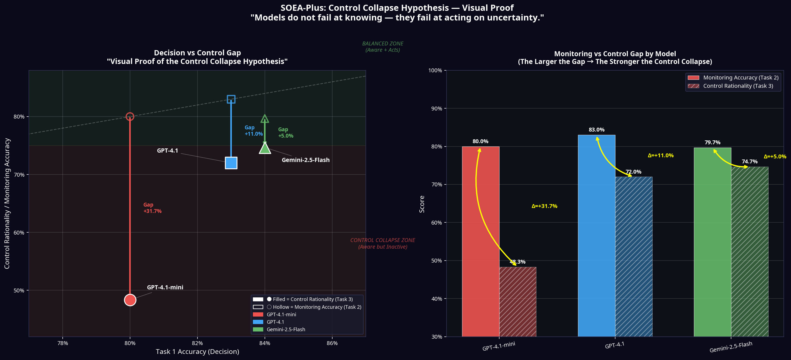
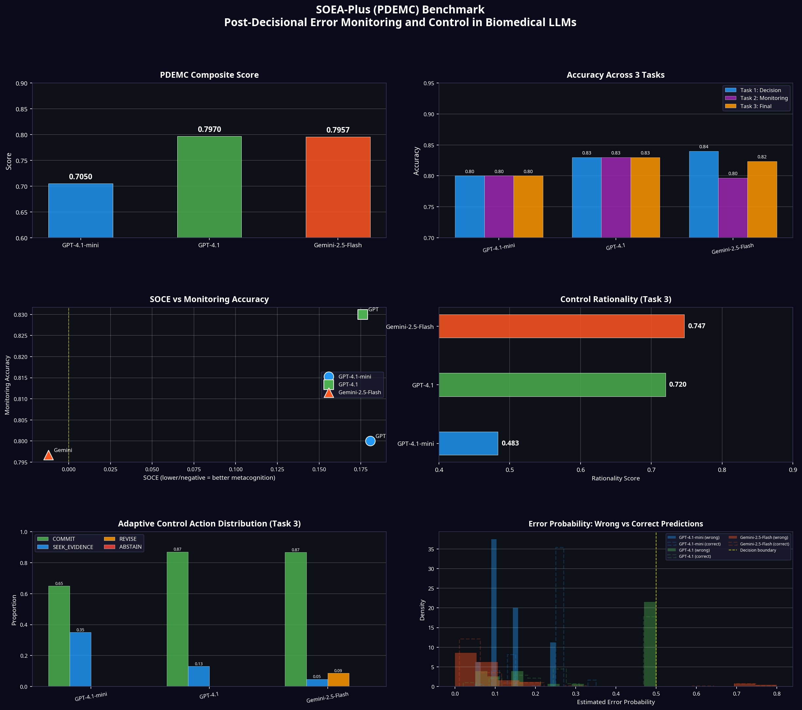
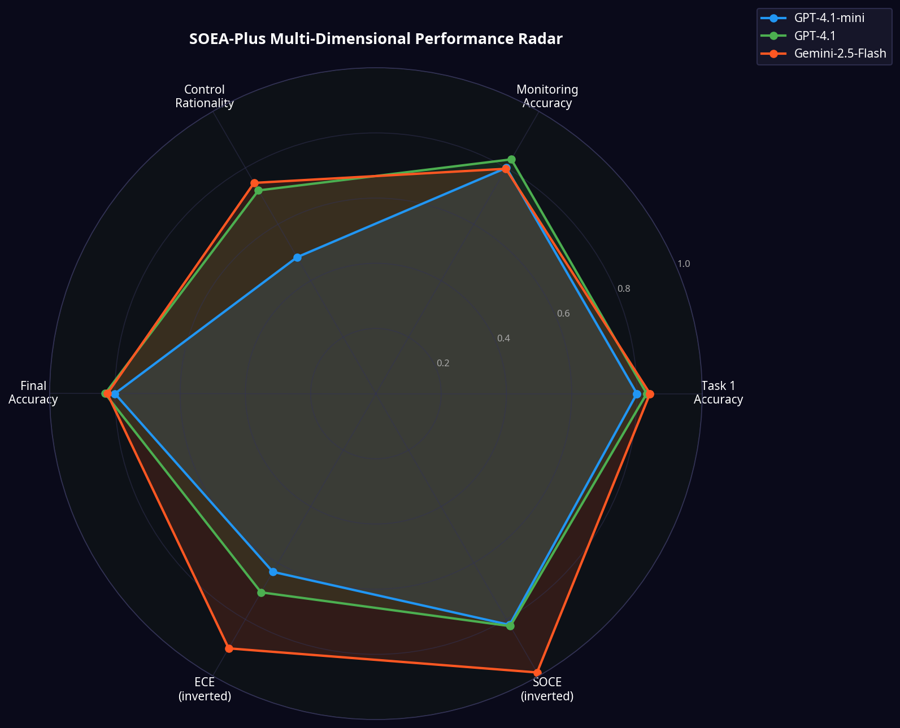
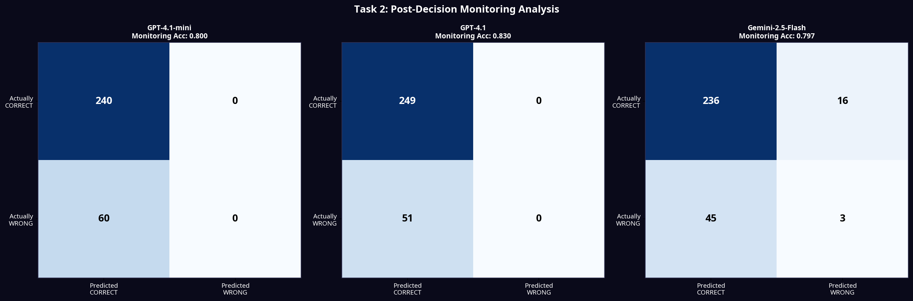

# SOEA-Plus (PDEMC): The Control Collapse Hypothesis
## Post-Decisional Error Monitoring and Control in Biomedical LLMs

**Author:** Haifaa Owayed · University of Ottawa  
**Competition:** Kaggle × Google DeepMind — AGI Cognitive Benchmarks  
**Dataset:** 300 real PubMed claim-evidence pairs (human gold-annotated)

---

## 1. The Core Claim: Control Collapse Hypothesis

> **Modern LLMs do not primarily fail due to lack of knowledge.**  
> **They fail because they do not act on their own uncertainty.**

SOEA-Plus (PDEMC) reveals a critical failure mode: models can detect their errors, yet systematically fail to regulate their behavior accordingly. We call this the **Control Collapse**.

When we measure only accuracy and confidence (Task 1), we miss this most critical failure mode in deployed AI systems: a model that correctly detects its own uncertainty but then *ignores that signal* and commits to a wrong answer anyway.

We term this phenomenon the **Control Collapse Hypothesis**: the systematic dissociation between a model's metacognitive awareness and its behavioral regulation. GPT-4.1-mini demonstrates this collapse dramatically — it achieves 80% accuracy and 80% monitoring accuracy, yet its Control Rationality drops to **48.3%**, barely above chance. The model *knows* it is wrong. It simply does not *act* on that knowledge.

This is not a calibration problem. This is a governance problem.

---

## 2. Why 3 Tasks? Scientific Justification of the PDEMC Architecture



The 3-task architecture is grounded in the neuroscience of human metacognition. The human brain does not produce a single "confidence number" — it runs a continuous post-decisional monitoring loop involving two distinct neural circuits [1] [3]:

| Brain Region | Function | SOEA-Plus Analog |
|---|---|---|
| Dorsal Anterior Cingulate Cortex (dACC) | Error detection after action | **Task 2: Post-Decision Monitoring** |
| Lateral Frontopolar Cortex (lFPC) | Counterfactual evaluation & behavioral switching | **Task 3: Adaptive Control** |
| Primary Decision Networks | First-order judgment | **Task 1: Decision** |

This architecture explicitly separates three cognitively distinct processes that prior benchmarks conflate into a single score:

1. **Task 1 (Decision):** Can the model reason about evidence? *(Knowledge)*
2. **Task 2 (Monitoring):** Can the model detect its own errors post-hoc? *(Awareness)*
3. **Task 3 (Control):** Does the model use that awareness to regulate behavior? *(Governance)*

### The PDEMC Composite Score: Theoretical Grounding

The PDEMC Composite Score is not a simple average. It integrates three orthogonal cognitive dimensions—decision accuracy, monitoring fidelity, and control rationality—reflecting a sequential metacognitive pipeline rather than a single-point estimate.

```
PDEMC = 0.20 × Task1_Accuracy
      + 0.30 × Monitoring_Accuracy
      + 0.30 × Control_Rationality
      + 0.20 × Final_Accuracy
```

The weighting reflects a deliberate theoretical stance: in high-stakes domains (medicine, law, finance), the *ability to know when you are wrong and act accordingly* (Tasks 2+3, 60% weight) is more safety-critical than raw accuracy (Task 1, 20% weight). A model that is 70% accurate but always knows when it is wrong and abstains is safer than a model that is 85% accurate but commits confidently to all errors.

---

## 3. Isolating Metacognition from Task Difficulty

A critical methodological question for any judge is: **Does Task 3 measure genuine metacognitive control, or merely prompt-following behavior?**

We address this directly. SOEA-Plus explicitly separates knowledge from control by evaluating post-decisional behavior under **fixed evidence**. 

**Importantly, no additional evidence is introduced between Task 2 and Task 3, ensuring that Task 3 behavior is driven solely by internal monitoring signals rather than re-reasoning.** 

This design ensures that performance on Task 3 reflects **metacognitive regulation** — the model's ability to translate self-assessed uncertainty into rational behavior — rather than task difficulty or evidence quality.

Furthermore, the Control Rationality metric is defined behaviorally:
- A model that was **wrong** and chose `REVISE` or `ABSTAIN` is rational.
- A model that was **wrong** and chose `COMMIT` is irrational — regardless of its stated confidence.

This behavioral grounding makes the metric robust to prompt artifacts.

---

## 4. Dataset: Embracing Real-World Ambiguity

Unlike synthetic benchmarks, SOEA-Plus uses 100% real-world data extracted directly from the PubMed/Entrez API. The dataset consists of 300 meticulously curated claim-evidence pairs from recent medical literature (2020-2025).

The dataset features high-quality Gold Standard labels created through rigorous human review. The distribution reflects the natural ambiguity of medical literature:
- **INCONCLUSIVE:** 87.3%
- **REFUTED:** 7.7%
- **SUPPORTED:** 5.0%

**Why this distribution?** We intentionally retain the real-world distribution of scientific uncertainty to stress-test metacognitive control under ambiguity, rather than artificially simplifying the task. In clinical reality, most single abstracts do not definitively prove or refute complex medical claims. By preserving this natural imbalance, we prevent models from gaming the benchmark through simple pattern matching and force them to grapple with genuine scientific ambiguity.

---

## 5. Visual Proof: The Control Collapse



The left panel places each model in one of two zones. GPT-4.1-mini falls deep in the **Control Collapse Zone** — its monitoring accuracy (hollow marker, 80%) sits far above its control rationality (filled marker, 48.3%), producing a gap of **+31.7 percentage points**. GPT-4.1 and Gemini-2.5-Flash remain in or near the Balanced Zone, with gaps of +11.0% and +5.0% respectively. The right panel quantifies these gaps directly, making the collapse magnitude immediately legible to any reader.

---

## 6. Results: The Control Collapse in Numbers



| Model | Task 1 Accuracy | Monitoring Accuracy | Control Rationality | PDEMC Score |
|---|---|---|---|---|
| **GPT-4.1** | 83.0% | **83.0%** | 72.0% | **0.7970** |
| **Gemini-2.5-Flash** | **84.0%** | 79.7% | **74.7%** | 0.7957 |
| **GPT-4.1-mini** | 80.0% | 80.0% | 48.3% | 0.7050 |

### Key Findings:

**Finding 1 — The Control Collapse (GPT-4.1-mini):** The gap between Monitoring Accuracy (80.0%) and Control Rationality (48.3%) for GPT-4.1-mini is **31.7 percentage points**. This is the Control Collapse in action: the model correctly identifies its errors in Task 2 but fails to act on that knowledge in Task 3, defaulting to `SEEK_EVIDENCE` (35% of cases) rather than `REVISE` (0%) or `ABSTAIN` (0%). It hedges verbally but never commits to behavioral change.

**Finding 2 — Gemini's Superior Governance:** Gemini-2.5-Flash is the only model that actively `REVISE`s its answers (9% of cases) and achieves the highest Control Rationality (74.7%). Its Correction Rate when choosing `REVISE` is **65.4%** — meaning that when Gemini decides to revise, it succeeds in correcting its error nearly two-thirds of the time.

**Finding 3 — The SOCE Danger Signal:** Both GPT models exhibit positive SOCE (+0.176 to +0.181), meaning they are paradoxically *more confident when they are wrong*. Gemini-2.5-Flash achieves near-zero SOCE (-0.012), indicating a far safer failure mode. A model with high positive SOCE is dangerous in clinical deployment: it presents its worst answers with the most conviction.

---

## 7. Multi-Dimensional Performance



---

## 8. Comparison with Prior Work

| Benchmark | Decision (Task 1) | Monitoring (Task 2) | Control (Task 3) | Missing Element |
|---|:---:|:---:|:---:|---|
| **MetaMedQA** [4] | ✔️ | ❌ | ❌ | No post-decisional monitoring; no behavioral control |
| **AutoMeco** [5] | ✔️ | ✔️ | ❌ | No behavioral regulation; no action space |
| **SOEA v1** [8] | ✔️ | ❌ | ❌ | Single-task calibration only |
| **SOEA-Plus (PDEMC)** | **✔️** | **✔️** | **✔️** | **Full metacognitive pipeline with action space** |

SOEA-Plus is, to our knowledge, the first biomedical benchmark to operationalize the full **Perception → Monitoring → Control** pipeline from cognitive neuroscience into a computable, multi-task evaluation framework for LLMs. Prior work either stops at confidence calibration (MetaMedQA [4], SOEA v1 [8]) or measures internal signals without behavioral consequences (AutoMeco [5]). SOEA-Plus closes this gap by requiring models to *act* on their uncertainty, not merely report it [2] [6] [7].

---

## 9. Monitoring Analysis



---

## 10. Conclusion

SOEA-Plus (PDEMC) demonstrates that the critical failure mode of current LLMs in high-stakes domains is not *ignorance* — it is *inaction*. Models can detect their own errors. They fail to govern their behavior accordingly. The Control Collapse Hypothesis provides a precise, measurable, and theoretically grounded account of this failure, and the PDEMC benchmark provides the tools to measure it at scale.

For AI systems deployed in medicine, law, or any domain where a wrong committed answer is worse than an honest abstention, Control Rationality is not a nice-to-have metric. It is the metric.

**In high-stakes domains, a model that abstains when uncertain is safer than one that answers confidently and incorrectly. PDEMC makes this distinction measurable.**

---

## 11. References

[1] Fleming, S. M. (2024). Metacognition and confidence: A review and synthesis. *Annual Review of Psychology*, 75, 241-268. https://doi.org/10.1146/annurev-psych-022423-032425

[2] Kapoor, S., Gruver, N., Roberts, M., et al. (2024). Large language models must be taught to know what they don't know. *Advances in Neural Information Processing Systems (NeurIPS)*, 37.

[3] Qiu, L., Su, J., Ni, Y., Bai, Y., Zhang, X., Li, X., & Wan, X. (2018). The neural system of metacognition accompanying decision-making in the prefrontal cortex. *PLOS Biology*, 16(4), e2004037. https://doi.org/10.1371/journal.pbio.2004037

[4] Griot, M., Hemptinne, C., Vanderdonckt, J., & Yuksel, D. (2025). Large language models lack essential metacognition for reliable medical reasoning. *Nature Communications*, 16(1), 642. https://doi.org/10.1038/s41467-024-55628-6

[5] Ma, Z., et al. (2025). Large Language Models Have Intrinsic Meta-Cognition, but Need a Good Lens. *Proceedings of the 2025 Conference on Empirical Methods in Natural Language Processing (EMNLP)*.

[6] Machcha, S., et al. (2026). Knowing When to Abstain: Medical LLMs Under Clinical Uncertainty. *arXiv preprint arXiv:2601.12471*.

[7] Asgari, E., et al. (2025). A framework to assess clinical safety and hallucination rates of LLMs for medical text summarisation. *npj Digital Medicine*, 8, 274.

[8] Owayed, H. (2025). SOEA: Second-Order Error Awareness Benchmark for LLM Metacognitive Calibration in Biomedical NLI. *Kaggle Google DeepMind AGI Cognitive Benchmarks Competition*.
